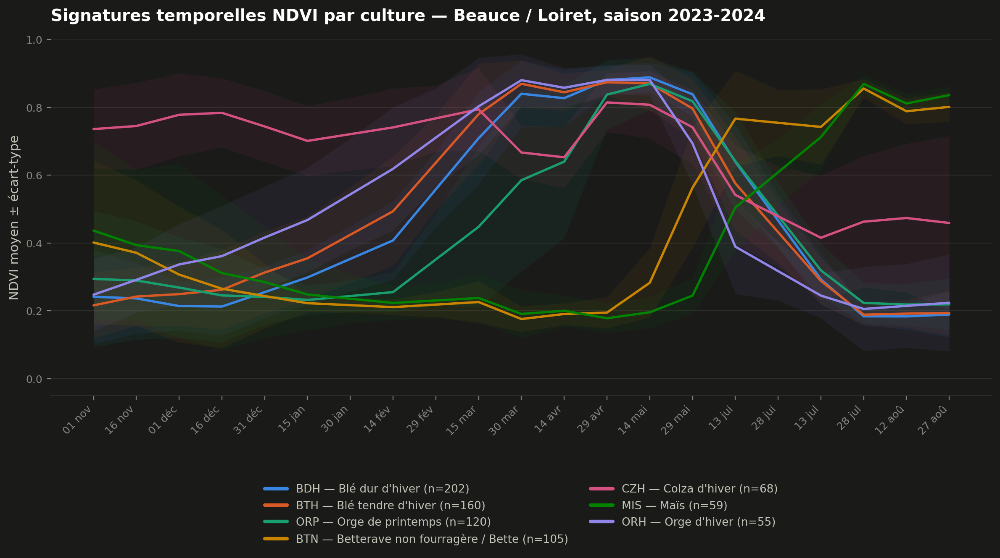
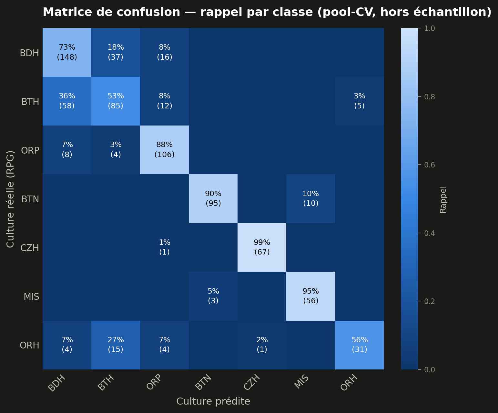
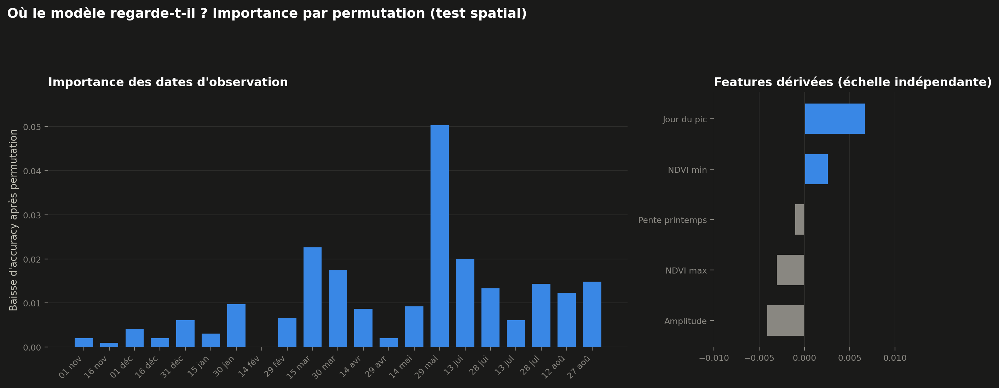
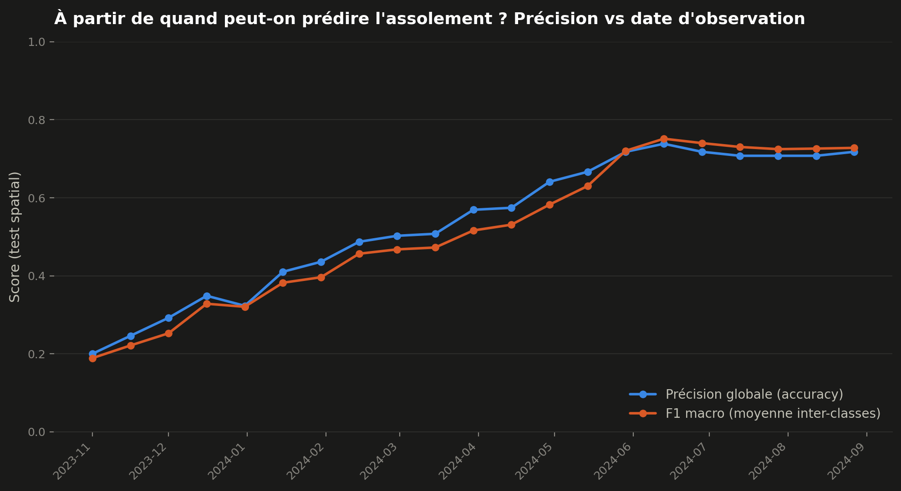
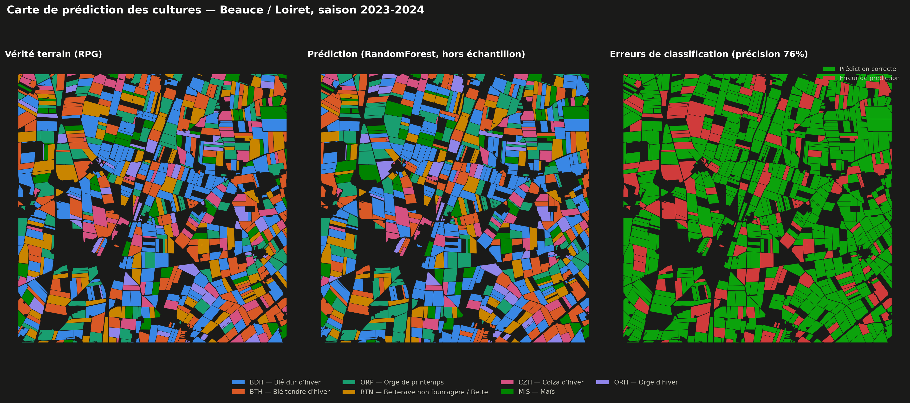
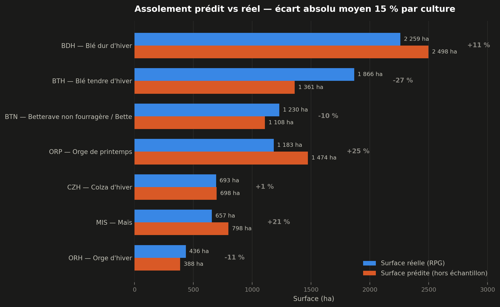

# Sentinel Crop ID — identifier les cultures depuis l'espace

Reconnaître ce qui pousse dans un champ, par satellite, avant même que
l'agriculteur ne l'ait déclaré.

## Le problème

L'assolement d'un territoire (quelle surface en blé, en colza, en maïs
cette année) intéresse toute la filière agricole : logistique de collecte,
approvisionnement des industriels, estimation de production, anticipation
des cours. Aujourd'hui cette information vient des déclarations PAC
(Politique Agricole Commune) des exploitants, consolidées dans le
[Registre Parcellaire Graphique](https://www.data.gouv.fr/datasets/rpg)
(RPG), et publiées avec plusieurs mois de retard, parfois plus d'un an.

Le satellite, lui, observe la même parcelle tous les 5 jours dès la sortie
d'hiver. L'idée testée ici est simple : la trajectoire de végétation d'une
parcelle pendant la saison suffit-elle, à elle seule, à reconnaître sa
culture, sans attendre aucune déclaration ?

## La méthode

1. **Cube de données NDVI** : imagerie Sentinel-2 (Copernicus, libre
   d'accès) sur une saison culturale complète, composites médians toutes
   les 15 jours, nuages masqués via la bande de classification de scène
   (SCL).
2. **Signatures parcellaires** : pour chaque parcelle agricole réelle
   (RPG), extraction de la série temporelle NDVI moyenne par zonal
   statistics, avec un buffer négatif pour éviter les pixels de bordure.
3. **Classification supervisée** : un RandomForest entraîné sur ces
   signatures, le RPG servant de vérité terrain, avec une validation
   spatiale stricte pour éviter la fuite d'information entre parcelles
   voisines.
4. **Carte de prédiction** : assolement prédit comparé à la vérité
   terrain, sur l'ensemble de la zone, en conditions hors échantillon.

```
build_datacube.py  ->  extract_parcel_signatures.py  ->  train_classifier.py  ->  make_prediction_map.py
(Sentinel-2, NDVI)      (zonal stats par parcelle)        (RandomForest,           (carte vérité vs
                                                            split spatial)           prédiction vs erreurs)
```

## Zone et données

- **Zone d'étude** : 10×10 km en Beauce, secteur d'Artenay (Loiret), une
  zone de grandes cultures très lisible centrée autour de 48.10°N, 1.90°E.
- **Millésime** : RPG 2024, le dernier publié par l'IGN (révision de
  novembre 2025), associé à la saison culturale novembre 2023 à août 2024
  (semis d'hiver à moisson) ; 40 scènes Sentinel-2 utilisées, couverture
  nuageuse inférieure à 60 %.
- **Cultures retenues** : les 7 classes majoritaires de la zone après
  filtre (au moins 50 parcelles), déterminées empiriquement plutôt que
  fixées à l'avance : blé dur d'hiver, blé tendre d'hiver, orge de
  printemps, betterave, colza d'hiver, maïs, orge d'hiver. Jachères et
  catégories administratives (bordures, surfaces non exploitées) sont
  exclues : elles n'ont pas de signature de culture à proprement parler.

## Résultats

### Les signatures temporelles : le cœur du projet



On voit à l'œil nu des trajectoires radicalement différentes. Le colza est
déjà haut dès l'automne (il forme sa rosette), reste sur un plateau, puis
se récolte tôt, en plein été. Les céréales d'hiver (blé dur, blé tendre,
orge d'hiver) montent ensemble au printemps, atteignent leur pic fin
avril-mi mai, puis s'effondrent à la moisson en juin-juillet. Maïs et
betterave, semés au printemps, font l'inverse : NDVI bas jusqu'en juin,
puis montée continue jusqu'à fin août. Le modèle n'a accès à rien d'autre
que cette diversité de calendriers.

### La classification



En validation croisée spatiale (5 blocs géographiques disjoints) :

| Modèle | Accuracy | F1 macro |
|---|---|---|
| RandomForest | 76.5 % ± 4.0 | 79.2 % ± 3.3 |
| HistGradientBoosting | 75.6 % ± 2.9 | 78.1 % ± 2.9 |

Les deux modèles se valent ; RandomForest est retenu comme plus simple et
plus interprétable.

Le tableau ci-dessus moyenne le F1 macro sur les 5 folds (utile pour
comparer les modèles). La matrice de confusion ci-dessus et les F1 par
classe ci-dessous utilisent un calcul différent, plus adapté au diagnostic
par classe : les prédictions hors-échantillon de chaque fold sont poolées sur
les 769 parcelles avant de calculer les scores, comme pour la carte de
prédiction plus bas. Sur un split unique de 195 parcelles, une classe
comme l'orge d'hiver (55 parcelles au total) n'est représentée que par une
quinzaine d'exemples en test, ce qui rend son F1 instable ; poolé sur les
5 folds, chaque parcelle est évaluée une fois hors échantillon et le total
retombe sur un F1 macro de 0.80, cohérent avec le 0.792 du tableau.

Les confusions ne sont pas aléatoires. Colza (F1 0.99) et betterave (0.93),
des calendriers bien distincts, sont quasi parfaitement reconnus ; le maïs
suit de près (0.90). Les erreurs se concentrent sur les trois céréales
d'hiver, dont les cycles de croissance se chevauchent fortement : le blé
tendre est le plus confondu (F1 0.56 — 36 % de ses parcelles prédites à
tort comme blé dur), suivi de l'orge d'hiver (0.67, souvent pris pour du
blé tendre) et du blé dur (0.70). C'est une confusion agronomique, pas un
raté du modèle.

### Ce que regarde le modèle



Pour savoir sur quelles dates le modèle s'appuie vraiment, on prend le
modèle déjà entraîné et, sur les données de test, on brouille au hasard
les valeurs NDVI d'une seule date entre les parcelles (chaque parcelle
récupère la valeur d'une autre à cette date-là) : si l'accuracy s'effondre,
c'est que cette date était déterminante ; si elle ne bouge pas, le modèle
ne s'en servait pas. Cette méthode a
l'avantage de mesurer l'impact réel sur des prédictions, plutôt qu'un
score interne à l'entraînement. Répétée date par date, elle fait ressortir
un pic net fin mai : le moment où les céréales d'hiver plafonnent juste
avant de sénescer, pendant que maïs et
betterave sont encore au ras du sol. C'est la période où les calendriers
divergent le plus, donc où les classes se séparent le mieux. Les features
dérivées (max, amplitude, date du pic, pente de printemps) n'apportent en
revanche quasiment rien de plus que la série brute ; deux sont même
légèrement négatives. Le feature engineering envisagé au départ du projet
n'a finalement pas été nécessaire : la série brute portait déjà
l'information.

### À partir de quand peut-on prédire l'assolement ?



C'est l'argument business chiffré du projet : la précision atteignable si
l'on ne disposait que des images jusqu'à telle date de la saison. On part
de 20 % en novembre (quasiment rien à distinguer), on franchit les 50 %
fin février, et on atteint un plateau autour de 71-74 % dès la mi-juin, un
mois avant la fin de la saison de croissance et plusieurs mois avant que
les déclarations PAC ne soient consolidées.

Une précaution anti-fuite s'applique à chaque date de coupure : les trous
nuageux sont interpolés uniquement à partir des observations déjà
disponibles à cette date-là (la matrice non interpolée existe séparément,
et l'interpolation se limite à la fenêtre déjà visible). Interpoler la
saison complète avant de découper aurait injecté des observations futures
dans les modèles de début de saison.

### La carte



Les prédictions affichées sont hors échantillon sur l'ensemble des 769
parcelles retenues : chaque parcelle est prédite par un modèle qui ne l'a
jamais vue à l'entraînement, via la même validation croisée spatiale.
Précision globale : 76.5 %. La carte d'erreurs montre qu'elles ne sont pas
réparties uniformément dans l'espace, ce qui recoupe la confusion
structurelle entre céréales d'hiver vue plus haut.

### L'assolement



Le pitch du projet porte sur l'assolement, les surfaces par culture à
l'échelle du territoire, pas sur des parcelles individuelles. Cette figure
y répond directement, avec les mêmes prédictions hors échantillon :

- Le colza est estimé à ±1 % près : son calendrier unique le rend fiable
  jusqu'à l'agrégation.
- L'écart absolu moyen est de 15 % par culture, mais très inégalement
  réparti. Les erreurs sont surtout des substitutions internes au bloc
  céréalier : blé tendre sous-estimé de 27 %, orge de printemps surestimée
  de 25 %.
- Toutes céréales confondues (blés et orges), l'écart tombe à −0,4 % : le
  modèle reconnaît "une céréale" presque parfaitement, il hésite seulement
  sur laquelle.

Pour un acteur qui raisonne en grandes masses (céréales, industrielles,
oléagineux), l'estimation est déjà exploitable. Pour distinguer blé tendre
et blé dur, en revanche, le NDVI seul ne suffit pas : il faudrait d'autres
bandes spectrales, ou du radar (voir limites).

## Compétences démontrées

| Domaine | Détail |
|---|---|
| Télédétection | Sentinel-2 L2A, calcul NDVI, masquage nuages par bande SCL, correction du décalage radiométrique BOA (baseline ESA ≥ 04.00) |
| Géospatial | API STAC (`pystac-client`, `planetary-computer`), cube de données paresseux (`odc-stac`, `xarray`, `dask`), zonal statistics vectorisées (rasterisation + groupby), CRS unique (Lambert-93) |
| Données ouvertes | RPG (IGN/ASP), gestion d'un format de livraison réel (GeoPackage, 7z, référentiels de nomenclature), scripting bout en bout sans étape manuelle |
| Machine learning | RandomForest / HistGradientBoosting, feature engineering simple (série brute + dérivées), gestion des classes déséquilibrées |
| Rigueur méthodologique | Split spatial par blocs géographiques (pas un split aléatoire), validation croisée GroupKFold, interpolation restreinte à la fenêtre observée pour la courbe de performance, importance par permutation, lecture agronomique des confusions |
| Data visualisation | Palette catégorielle validée (séparabilité daltonisme), cohérence visuelle inter-figures, cartographie choroplèthe |

## Limites

- **Une seule zone, un seul millésime.** La généralisation à une autre région
  ou une autre année n'est pas démontrée ici (voir extensions futures).
- **Le RPG est déclaratif.** Il contient ses propres erreurs (erreur de
  déclaration, culture dérobée non signalée, parcelle mal dessinée) : une
  partie du "bruit" mesuré est du bruit d'étiquette (*label noise*), pas
  une erreur du modèle.
- **Les classes rares sont écartées.** Des cultures réelles de la zone
  (pomme de terre, oignon...) ne sont pas modélisées faute d'effectif
  suffisant (moins de 50 parcelles) : l'assolement complet n'est pas
  couvert.
- **Le découpage par blocs géographiques réduit la fuite entre parcelles
  voisines, mais ne l'élimine pas complètement.** À l'intérieur d'un même
  bloc de 2 km, les parcelles peuvent partager le même type de sol ou les
  mêmes pratiques agricoles (dates de semis, exploitant) : le modèle peut
  encore profiter un peu de ces ressemblances locales, même sans avoir vu
  exactement la même parcelle.
- **Le cadrage temporel de l'évaluation n'est pas celui du déploiement
  réel.** Train et test partagent ici le même millésime (2023-2024) : le
  split spatial protège contre la fuite entre parcelles voisines, mais pas
  contre une spécificité propre à cette saison (pluviométrie, dates de
  semis) qui ne se reproduirait pas forcément l'année suivante. En usage
  réel, pour anticiper l'assolement d'une saison en cours, on entraînerait
  sur le millésime N-1 pour prédire N : un écart plus dur que celui mesuré
  ici, qui reste à quantifier (voir extensions futures).

## Reproduire

```bash
pip install -r requirements.txt

python src/download_rpg.py            # RPG région Centre-Val de Loire (~800 Mo)
python src/build_datacube.py          # cube NDVI Sentinel-2 (Planetary Computer)
python src/extract_parcel_signatures.py
python src/plot_signatures.py
python src/train_classifier.py
python src/make_prediction_map.py
```

Zone, dates, seuils et chemins sont centralisés dans `src/config.py`. Le
pipeline complet tourne en moins d'une heure sur un ordinateur portable, une
fois les données téléchargées. Seed fixée (`RANDOM_SEED = 42`) pour la
reproductibilité.

Le raisonnement complet (problème → données → signatures → modèle → carte →
limites) est orchestré dans
[`notebooks/classification_cultures_sentinel2.ipynb`](notebooks/classification_cultures_sentinel2.ipynb).

```
sentinel-crop-id/
├── src/
│   ├── config.py                    # zone, dates, CRS, classes, chemins
│   ├── download_rpg.py              # RPG (IGN/ASP) : téléchargement + extraction
│   ├── build_datacube.py            # Sentinel-2 -> cube NDVI (STAC, dask)
│   ├── extract_parcel_signatures.py # zonal stats par parcelle
│   ├── plot_signatures.py           # LE visuel signature du projet
│   ├── train_classifier.py          # RandomForest, split spatial, matrice, courbe
│   ├── make_prediction_map.py       # carte vérité vs prédiction vs erreurs
│   └── viz_common.py                # palette et ordre de classes partagés
├── outputs/                         # figures (versionnées)
├── notebooks/                       # notebook narratif
└── data/                            # non versionné, reconstruit par les scripts
```

## Sources et licences

- **Imagerie satellite** : Copernicus Sentinel-2 data, via
  [Microsoft Planetary Computer](https://planetarycomputer.microsoft.com/).
- **Vérité terrain** : Registre Parcellaire Graphique © IGN — [Licence
  Ouverte / Open Licence Etalab](https://www.etalab.gouv.fr/licence-ouverte-open-licence/).
- **Code** : licence MIT (voir `LICENSE`).

Aucune donnée propriétaire, aucune référence à un employeur.

## Extensions futures

Pistes non implémentées ici, pour une suite éventuelle :

- **Impact d'une sécheresse** : comparaison NDVI inter-annuelle sur la même
  zone.
- **Détection automatique de la date de moisson** : rupture de pente du
  NDVI.
- **Test de généralisation** : appliquer le modèle entraîné ici à une autre
  zone ou une autre année, pour mesurer ce qui se dégrade réellement hors du
  cadre d'entraînement.
